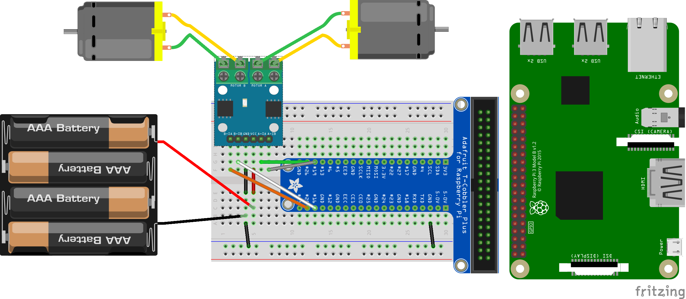

# Actionneur double pont en H L9110

Mise en œuvre du double pont en H L9110 avec Raspberry Pi et Python.

## Double pont en H

Mise en oeuvre du pont en H.

[Qu'est ce qu'un pont en H](https://fr.wikipedia.org/wiki/Pont_en_H)

Documentation technique du [double pont en H L9110S](http://me.web2.ncut.edu.tw/ezfiles/39/1039/img/617/L9110_2_CHANNEL_MOTOR_DRIVER.pdf)

Fonctionnement du PWM [MLI](https://fr.wikipedia.org/wiki/Modulation_de_largeur_d%27impulsion), [Faire varier la vitesse du moteur](https://openclassrooms.com/fr/courses/2778161-programmez-vos-premiers-montages-avec-arduino/3285333-le-moteur-a-courant-continu-partie-1-transistors-et-sorties-pwm).

## Montage et branchement du double pont en H



## Configuration Raspberry Pi

Pas de configuration particulière de la Raspberry Pi, il s'agit d'une utilisation simple des broches GPIO.

## Programmation Python

Création et activation d'un environnement python virtuel:

```bash
$ python3 -m venv L9110_H_bridge
$ cd L9110_H_bridge
$ source bin/activate
(L9110_H_bridge) $ 
```

Installation des dépendances:

```bash
(L9110_H_bridge) $ pip3 install -r requirements.txt
Collecting RPi.GPIO==0.7.0 (from -r requirements.txt (line 1))
  Downloading https://files.pythonhosted.org/packages/cb/88/d3817eb11fc77a8d9a63abeab8fe303266b1e3b85e2952238f0da43fed4e/RPi.GPIO-0.7.0.tar.gz
Collecting rpimotorlib==2.7 (from -r requirements.txt (line 2))
  Downloading https://files.pythonhosted.org/packages/c1/23/34d4218e1c3af5f9965528fb7dbc7eded1df9fc93edfb4de0494d0820af1/rpimotorlib-2.7.tar.gz
packages (from rpimotorlib==2.7->-r requirements.txt (line 2))
Installing collected packages: RPi.GPIO, rpimotorlib
  Running setup.py install for RPi.GPIO ... done
  Running setup.py install for rpimotorlib ... done
Successfully installed RPi.GPIO-0.7.0 rpimotorlib-2.7
(L9110_H_bridge) $
```

Utilisation du double pont en H L9110, avance et arrêt d'un des moteurs par le programme *prog_l9110.py*:

```python
import time 
import RPi.GPIO as GPIO
from RpiMotorLib import rpi_dc_lib 

print(" TEST: test moteur sur les broches 19 et 26 ") 
# configuration du moteur
DIRECTION_GPIO = 26
# vitesse => GPIO qui utilise le PWM
VITESSE_GPIO = 19
Motor = rpi_dc_lib.DRV8833NmDc(DIRECTION_GPIO ,VITESSE_GPIO ,50 ,True, "motor_one")

try:
  print("moteur en avant")
  Motor.forward(15)
  input("appuyer sur une touche pour stopper le moteur") 
  print("moteur à l'arrêt")
  Motor.stop(0)
  time.sleep(3)
finally:
  Motor.cleanup(False)
```

```bash
# démarrer le programme 
(L9110_H_bridge) $ python3 prog_l9110.py

```

Désactivation de l'environnement python virtuel:

```bash
(L9110_H_bridge) $ deactivate
$
```

## Références

  * https://fr.wikipedia.org/wiki/Pont_en_H
  * https://github.com/gavinlyonsrepo/RpiMotorLib
  * https://github.com/gavinlyonsrepo/RpiMotorLib/blob/master/Documentation/L9110S_DC.md
  * https://pypi.org/project/RPi.GPIO/

